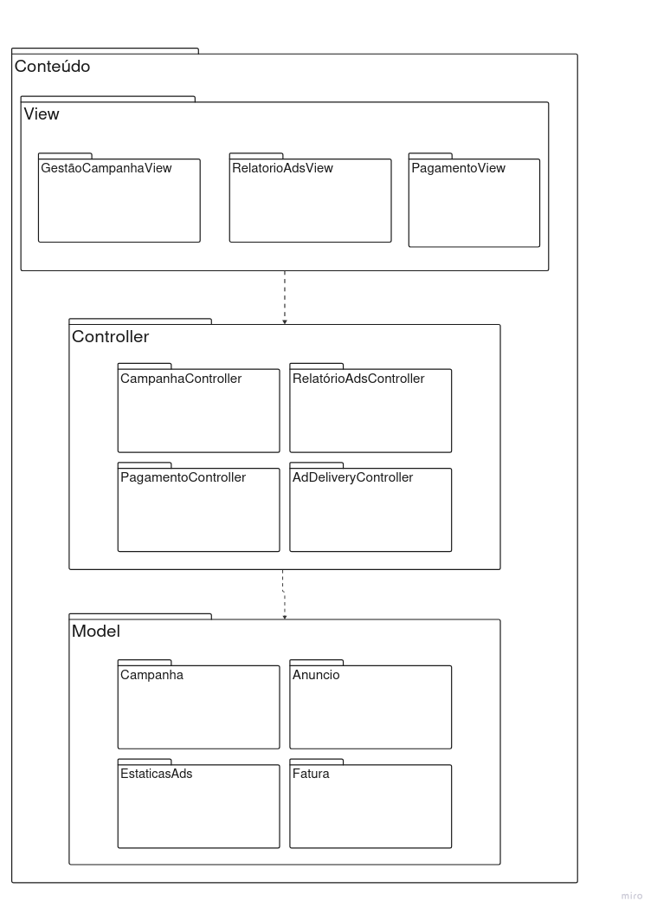

# SubEquipe_03
O relatório deverá conter a estrutura de focos estabelecida a seguir, bem como versionamentos, metodologia e participantes por foco.
Não omitir tópicos.

## Focos do Relatório:
### FOCO_01: Modelagem Estática
Entrega Mínima: um modelo estático, na notação UML.
Mira-se no MM no FOCO, com a entrega mínima.
### Participantes no Foco_01
| Nome do Membro |
|---|
| Bruno Souza Assis Furtado |
| Alberto Côrtes Cavalcante |
| Kaio Amoury Sasaki Acacio |
| Pedro Felipe Silva Vargas |

### Metodologia do Foco_01
A elaboração da modelagem estática foi conduzida por meio de sessões de alinhamento em equipe, partindo da engenharia reversa desenvolvida na Entrega 1. O subgrupo definiu a separação de responsabilidades no padrão arquitetural MVC para o subsistema de Monetização e Anúncios, estruturando os pacotes das camadas View, Controller e Model de forma desacoplada. Os diagramas foram rascunhados inicialmente no Miro e refinados também no Miro para documentação versionada.

### Modelo Estático

#### Diagrama de Pacotes — subdomínio Conteúdo (MVC)

A seguir é apresentado o Diagrama de Pacotes do subdomínio de Monetização e Anúncios (Ads), modelado sob o pacote-container principal `Conteúdo`. O modelo foi concebido para representar a organização estrutural e o fluxo de dependências do sistema por meio do padrão arquitetural MVC (Model-View-Controller).

**Figura 1** — Diagrama de Pacotes.  
**Autor:** Subgrupo 3. | **Elaborado em:** Miro — G2 ProjetoForum

O diagrama organiza o subsistema nas três camadas clássicas da arquitetura MVC:

* `View` — camada de apresentação, contendo `GestãoCampanhaView`, `RelatorioAdsView` e `PagamentoView`.
* `Controller` — camada de controle e regras de fluxo, contendo `CampanhaController`, `RelatórioAdsController`, `PagamentoController` e `AddDeliveryController`.
* `Model` — camada de dados e regras de negócio, contendo `Campanha`, `Anuncio`, `EstaticasAds` e `Fatura`.
* As setas tracejadas `View` $\rightarrow$ `Controller` $\rightarrow$ `Model` representam as dependências unidirecionais entre as camadas, garantindo a separação de responsabilidades onde a camada de apresentação interage com o controle, que por sua vez gerencia o modelo de dados, mantendo o acoplamento baixo.

### FOCO_02: Modelagem Dinâmica
Entrega Mínima: um modelo dinâmico, na notação UML.
Mira-se no MM no FOCO, com a entrega mínima.
### Participantes no Foco_02
| Nome do Membro |

EXEMPLO:
| Fulano |
### Metodologia do Foco_02
Espaço para contar um pouco sobre como ocorreu o trabalho em equipe. Vídeos ajudam aqui.
### Modelo Dinâmico
Modelo dinâmico na notação UML.

#
### FOCO_03: IA Generativa
Entrega Mínima: pontos de vista de cada membro da equipe sobre as lições aprendidas e uso da IA Generativa.
TODOS DEVEM PARTICIPAR!
### Participantes no Foco_03
| Nome do Membro | Lições Aprendidas | Uso da IA Generativa (SENSO CRÍTICO) |
|---|---|---|
| Bruno Souza Assis Furtado | Por questão de tempo e de ocupação, recorri ao uso da IA para geração e modelagem dos diagramas. Reuni todo o conteúdo avaliado da entrega 1 que foi necessário, estruturei e organizei os para que servisse de orientação na hora da criação dos modelos/diagramas. Discutindo em equipe, temos tido bons resultados com o uso da IA, seguidos sempre pela nossa verificação e validação como subgrupo. | Os primeiros modelos gerados por IA vieram visualmente poluídos (mesmo se tratando de diagramas que envolvem muitas informações e conteúdo). O que me surpreendeu foi que, em pouquíssimas vezes, a geração veio com informações incorretas, extras ou desnecessárias. A maioria vinha de forma organizada, rígida e estruturada (tecnicamente falando). Tenho utilizado bastante o ChatGPT, que mesmo às vezes não recebendo um nível alto de detalhe nos prompts, tem gerado bons resultados juntamente com instrumentos e comentários para análise do que foi requisitado. |

#
## Versionamentos
| Nome do Membro | Contribuição | Data |
|---|---|---|
| Subgrupo 3 | Elaboração e revisão do Diagrama de Pacotes MVC (Foco 01) | 17/09/2026 |
| Bruno Souza Assis Furtado | Relato sobre o uso de IA Generativa (Foco 03) | 17/09/2026 |

--
# Observações: 
Entregável: Relatório, documentado no GitPages, revelando:
## Entrega Mínima (por subgrupo da equipe): um modelo estático na notação UML, um modelo dinâmico na notação UML, e pontos de vista de cada membro da equipe sobre as lições aprendidas e uso da IA Generativa. Mira-se no MM, com a entrega mínima.

## Como ir além, para conseguir menções superiores?
Embasar cada artefato gerado e cada decisão tomada na literatura;
Manter rastros claros para o trabalho em equipe (ex. vídeos das reuniões e atas bem elaboradas), evidenciando práticas metodológicas (ex. reuniões periódicas das metodologias ágeis; checklists; debates, e assim vai);
Usar os vários recursos de modelagem da notação UML, e
Reportar os pontos de vista de forma fundamentada, clara e com senso crítico.

## 📌A ideia não é quantidade, e sim qualidade do que é entregue.

## Apresentação:
Apresentação (para a professora) explicando o artefato elaborado, com: (i) rastro claro aos membros participantes (MOSTRAR QUADRO DE PARTICIPAÇÕES & COMMITS); (ii) justificativas & senso crítico sobre o trabalho realizado, e (iii) comentários gerais sobre o trabalho em equipe. Tempo da Apresentação: +/- 10min. Recomendação: Apresentar diretamente via Wiki ou GitPages do Projeto. Baixar os conteúdos com antecedência, evitando problemas de internet no momento de exposição nas Dinâmicas de Avaliação.

A Wiki ou GitPages do Projeto deve conter, PARA CADA SUBGRUPO, um tópico dedicado ao relatório com a entrega mínima, versionamentos, referências, e demais detalhamentos gerados pela equipe nesse escopo.
Demais orientações disponíveis nas Diretrizes (vide Aprender3).
