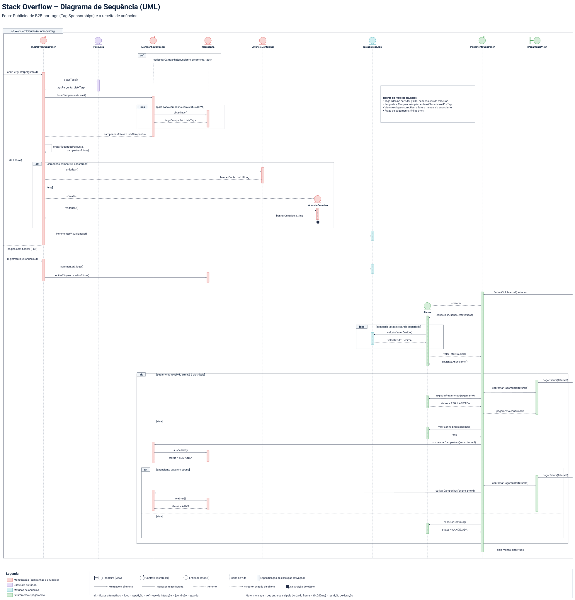

# SubEquipe_03
O relatório deverá conter a estrutura de focos estabelecida a seguir, bem como versionamentos, metodologia e participantes por foco.
Não omitir tópicos.

## Focos do Relatório:
### FOCO_01: Modelagem Estática
Entrega Mínima: um modelo estático, na notação UML.
Mira-se no MM no FOCO, com a entrega mínima.
### Participantes no Foco_01
| Nome do Membro |
|---|
| Bruno Souza Assis Furtado |
| Alberto Côrtes Cavalcante |
| Kaio Amoury Sasaki Acacio |
| Pedro Felipe Silva Vargas |

### Metodologia do Foco_01
A elaboração da modelagem estática foi conduzida por meio de sessões de alinhamento em equipe, partindo da engenharia reversa desenvolvida na Entrega 1. O subgrupo definiu a separação de responsabilidades no padrão arquitetural MVC para o subsistema de Monetização e Anúncios, estruturando os pacotes das camadas View, Controller e Model de forma desacoplada. Os diagramas foram rascunhados inicialmente no Miro e refinados também no Miro para documentação versionada.

### Modelo Estático

#### Diagrama de Pacotes — subdomínio Conteúdo (MVC)

A seguir é apresentado o Diagrama de Pacotes do subdomínio de Monetização e Anúncios (Ads), modelado sob o pacote-container principal `Conteúdo`. O modelo foi concebido para representar a organização estrutural e o fluxo de dependências do sistema por meio do padrão arquitetural MVC (Model-View-Controller).

**Figura 1** — Diagrama de Pacotes.  
**Autor:** Subgrupo 3. | **Elaborado em:** Miro — G2 ProjetoForum

O diagrama organiza o subsistema nas três camadas clássicas da arquitetura MVC:

* `View` — camada de apresentação, contendo `GestãoCampanhaView`, `RelatorioAdsView` e `PagamentoView`.
* `Controller` — camada de controle e regras de fluxo, contendo `CampanhaController`, `RelatórioAdsController`, `PagamentoController` e `AddDeliveryController`.
* `Model` — camada de dados e regras de negócio, contendo `Campanha`, `Anuncio`, `EstaticasAds` e `Fatura`.
* As setas tracejadas `View` $\rightarrow$ `Controller` $\rightarrow$ `Model` representam as dependências unidirecionais entre as camadas, garantindo a separação de responsabilidades onde a camada de apresentação interage com o controle, que por sua vez gerencia o modelo de dados, mantendo o acoplamento baixo.

#### Diagrama de Classes — módulo de Ads

A seguir está o Diagrama de Classes UML do módulo de Ads, cobrindo criação de campanha, veiculação por tags, métricas e faturamento. O modelo foi elaborado no Miro a partir das regras de negócio da engenharia reversa de anúncios da Entrega 1.

> 💡 *Dica: Para explorar todos os detalhes com zoom interativo (`Ctrl + Scroll` do mouse) e navegação livre, utilize o link abaixo para abrir o diagrama vetorial em uma aba dedicada:*  
> 🔍 **[Abrir Diagrama de Classes em Alta Resolução em Nova Aba](/Base/Relatórios/assets/diagrama-classes-ads.svg ':target=_blank')**

**Figura 3** — Diagrama de Classes do módulo de Ads. *(Clique na imagem ou no link acima para abrir em nova aba com zoom)*  
**Autor:** Kaio Amoury. | **Elaborado em:** Miro

O diagrama organiza o domínio em blocos claros. `Pergunta` e `Tag` representam o conteúdo classificado do fórum. `Anunciante` cria `Campanha`, que se associa às tags patrocinadas. `Anuncio` é abstrato e se especializa em `AnuncioContextual` ou `AnuncioGenerico`, conforme haja correspondência de tags. `EstatisticasAds` registra visualizações e cliques. `Fatura` e `Pagamento` fecham o ciclo mensal de cobrança, com prazo de cinco dias úteis.

##### Avaliação crítica

O modelo cobre bem criação, veiculação e cobrança. A interface `ClassificavelPorTag` e a herança de `Anuncio` evitam misturar regras distintas numa classe só. O ponto frágil é o Ad Server: ele aparece nas regras do fluxo e ainda não está explícito como classe própria. Em uma próxima iteração, vale torná-lo visível no diagrama e revisar se `Pergunta` deve permanecer no módulo de Ads ou apenas ser referenciada como contexto externo.

### FOCO_02: Modelagem Dinâmica
Entrega Mínima: um modelo dinâmico, na notação UML.
Mira-se no MM no FOCO, com a entrega mínima.
### Participantes no Foco_02
| Nome do Membro |
|---|
| Bruno Souza Assis Furtado |
| Alberto Côrtes Cavalcante |
| Kaio Amoury Sasaki Acacio |
| Pedro Felipe Silva Vargas |

### Metodologia do Foco_02
A elaboração da modelagem dinâmica foi realizada em sessões conjuntas de alinhamento pelo Subgrupo 3, tendo como ponto de partida a arquitetura MVC definida no Foco 01 e os requisitos de negócio levantados na Entrega 1 para o módulo de Monetização e Anúncios. O grupo optou por representar o comportamento dinâmico através de um **Diagrama de Sequência (UML)**, capturando tanto o ciclo de vida de entrega de anúncios em tempo real (baseado no contexto de tags da pergunta) quanto o processamento em lote do faturamento mensal e tratamento de inadimplência. As interações temporais, mensagens e fragmentos combinados (`alt`, `loop`, `ref`) foram rascunhados e refinados colaborativamente utilizando a ferramenta Miro.

### Modelo Dinâmico

#### Diagrama de Sequência — Ciclo de Vida e Faturamento do Módulo de Ads

O Diagrama de Sequência a seguir modela o comportamento dinâmico do subsistema de Monetização e Anúncios (Ads), detalhando as interações temporais entre as camadas de Apresentação, Controle e Modelo de Negócio. O modelo atende a dois grandes cenários arquiteturais:
1. **Entrega de Anúncio e Registro de Cliques (Tempo Real / SSR):** Resolução inteligente de patrocínio contextual com base nas tags da pergunta acessada — garantindo conformidade com privacidade ao não utilizar cookies de terceiros — com provisionamento de anúncio genérico como fallback e registro de impressões e cliques.
2. **Ciclo Mensal de Faturamento e Inadimplência (Processamento Periódico):** Fechamento financeiro periódico, cálculo de valores devidos, envio de faturas aos anunciantes, janela de tolerância de 5 dias úteis para quitação e transições de estado das campanhas (ativação, suspensão e cancelamento).

> 💡 *Dica: Para explorar todos os detalhes com zoom interativo (`Ctrl + Scroll` do mouse) e navegação livre, utilize o link abaixo para abrir o diagrama vetorial em uma aba dedicada:*  
> 🔍 **[Abrir Diagrama de Sequência em Alta Resolução em Nova Aba](./assets/DiagramaSequenciaAds.svg ':target=_blank')**

**Figura 2** — Diagrama de Sequência do Módulo de Ads. *(Clique na imagem ou no link acima para abrir em nova aba com zoom)*  
**Autor:** Subgrupo 3. | **Elaborado em:** Miro — G2 ProjetoForum

O fluxo dinâmico é estruturado em quatro etapas principais:

1. **Seleção Contextual e Exibição do Anúncio (SSR):**
   - Ao receber o evento de requisição de uma pergunta (`abrirPergunta(perguntaId)`), o `AdDeliveryController` requisita à entidade `Pergunta` as tags associadas via `obterTags()`.
   - Em seguida, aciona o `CampanhaController` por meio de `listarCampanhasAtivas()`, que itera em um fragmento `loop` sobre as campanhas ativas para extrair suas respectivas tags contratadas (`obterTags()`).
   - O `AdDeliveryController` executa a auto-chamada `cruzarTags(tagsPergunta, campanhasAtivas)`. Através de um fragmento condicional `alt`:
     - **Caminho Principal (`[campanha compatível encontrada]`):** Aciona `AnuncioContextual.renderizar()`, retornando o banner personalizado para aquela tecnologia.
     - **Caminho Alternativo (`[else]`):** Instancia dinamicamente um `AnuncioGenerico` (`<<create>>`), realiza sua renderização e encerra seu ciclo de vida (destruição com `X`).
   - A métrica de visualização é registrada via `EstatisticasAds.incrementarVisualizacoes()` e o HTML com o banner integrado é retornado ao cliente via Server-Side Rendering (SSR).

2. **Engajamento e Débito de Orçamento:**
   - Quando o visitante clica no banner (`registrarClique(anuncioId)`), o `AdDeliveryController` aciona `EstatisticasAds.incrementarClique()`.
   - Simultaneamente, a entidade `Campanha` executa `debitarClique(custoPorClique)`, atualizando o saldo orçamentário do anunciante em tempo real.

3. **Fechamento do Ciclo Mensal e Faturamento:**
   - Disparado pelo evento periódico `fecharCicloMensal(periodo)`, o `PagamentoController` cria uma nova instância de `Fatura` (`<<create>>`).
   - Através de um fragmento `loop`, a fatura itera sobre cada registro de `EstatisticasAds` do período, invocando `calcularValorDevido()` para computar o `valorTotal`.
   - A fatura consolidada é então enviada ao anunciante (`enviarFaturaAnunciante()`).

4. **Tratamento de Cobrança, Inadimplência e Transições de Estado:**
   - Um fragmento `alt` gerencia a janela de pagamento de **5 dias úteis**:
     - **Pagamento Tempestivo (`[pagamento recebido em até 5 dias úteis]`):** O anunciante realiza a quitação via `PagamentoView.pagarFatura(faturaId)`. O `PagamentoController` confirma a liquidação, a `Fatura` registra o pagamento e atinge a invariante de estado `{status = REGULARIZADA}`.
     - **Inadimplência (`[else]`):** Passado o prazo, o sistema constata a inadimplência (`verificarInadimplencia(hoje) -> true`). O `PagamentoController` aciona `CampanhaController.suspenderCampanhas(anuncianteId)`, colocando as campanhas no estado `{status = SUSPENSA}`.
     - Em um sub-fragmento `alt`: se o anunciante quitar os débitos em atraso, o controlador executa `reativarCampanhas(...)` e a campanha retorna ao estado `{status = ATIVA}`; caso contrário (`[else]`), a conta e os contratos são encerrados com `{status = CANCELADA}`.

#
### FOCO_03: IA Generativa
Entrega Mínima: pontos de vista de cada membro da equipe sobre as lições aprendidas e uso da IA Generativa.
TODOS DEVEM PARTICIPAR!
### Participantes no Foco_03
| Nome do Membro | Lições Aprendidas | Uso da IA Generativa (Senso Crítico) |
| -- | -- | -- |
| Alberto Côrtes Cavalcante | Nesta entrega, aprendi que a IA generativa acelera bastante o primeiro esboço de um diagrama UML, mas que isso só é útil se eu já souber, de antemão, o que cada diagrama exige formalmente. A modelagem correta (direção de setas, diferença entre composição e agregação, tipo de linha entre pacotes, multiplicidade) ainda depende de domínio da própria disciplina: sem isso, é fácil aceitar um resultado que parece pronto, mas está tecnicamente errado. A principal lição foi perceber que, quanto mais formal é a notação exigida, maior é a taxa de erro da IA e maior a necessidade de conferir cada detalhe na documentação de UML e no material da disciplina antes de dar o esboço como válido. | Usei IA generativa principalmente para gerar rascunhos iniciais de diagrama de componentes e de classes a partir do modelo de monetização levantado na Entrega 01, como ponto de partida para a discussão em grupo (ver [Ata 01](../iniciativas_extras/atas_reuniao/subequipe_03/ata-01-onboarding.md) e [Ata 02](../iniciativas_extras/atas_reuniao/subequipe_03/ata-02-modelagem.md)). Na prática, boa parte desses rascunhos precisou ser corrigida manualmente depois: em uma das tentativas, a IA confundiu diagrama de pacotes com diagrama de classes, errou a direção de setas e criou uma classe que não fazia sentido para o domínio modelado (ver Ata 02). Diante dos erros recorrentes, o grupo optou por modelar manualmente o diagrama de pacotes no quadro do Miro, lendo a documentação da disciplina para confirmar detalhes de notação, como o uso de setas tracejadas entre pacotes. A lição prática foi que a IA ajuda a ganhar tempo no início do trabalho e a organizar ideias, mas não substitui a leitura da documentação de UML nem a revisão humana atenta: usada sem crítica, ela produz um diagrama que parece completo, mas está formalmente incorreto. |
| Bruno Souza | Por questão de tempo e de ocupação, recorri ao uso da IA para geração e modelagem dos diagramas. Reuni todo o conteúdo avaliado da entrega 1 que foi necessário, estruturei e organizei os para que servisse de orientação na hora da criação dos modelos/diagramas. Discutindo em equipe, temos tido bons resultados com o uso da IA, seguidos sempre pela nossa verificação e validação como subgrupo. | Os primeiros modelos gerados por IA vieram visualmente poluídos (mesmo se tratando de diagramas que envolvem muitas informações e conteúdo). O que me surpreendeu foi que, em pouquíssimas vezes, a geração veio com informações incorretas, extras ou desnecessárias. A maioria vinha de forma organizada, rígida e estruturada (tecnicamente falando). Tenho utilizado bastante o ChatGPT, que mesmo às vezes não recebendo um nível alto de detalhe nos prompts, tem gerado bons resultados juntamente com instrumentos e comentários para análise do que foi requisitado. |
| Kaio Amoury Sasaki Acacio | Na modelagem estática do módulo de Ads, ficou claro que o diagrama de classes só ajuda quando reflete o negócio de ponta a ponta: tag da pergunta, campanha ativa, anúncio contextual ou genérico, métrica e fatura. Separar conteúdo do fórum, monetização e cobrança em classes distintas deixou o fluxo mais legível e mais fácil de justificar na entrega. | A IA generativa serviu para organizar atributos, métodos e checar multiplicidades no rascunho do diagrama de classes. O resultado inicial ainda misturava detalhes de notação e precisou de revisão manual no Miro, com conferência da UML e das regras do fluxo de anúncios. Em outras palavras, a ferramenta acelera o primeiro esboço, mas a validade formal do modelo depende de curadoria humana. |
| Pedro Vargas | _A preencher_ | _A preencher_ |

#
## Versionamentos

| Nome do Membro | Contribuição | Data | Página (rastreamento) |
| -- | -- | -- | -- |
| Alberto Côrtes Cavalcante | Preenche Código de Conduta, guia de Contribuição e `.gitignore` da Entrega 02. | 17/09/2026 | [Ver commit](https://github.com/UnBArqDsw2026-2-Turma02/2026.2-T02-_G2_ProjetoForum_Entrega02/commit/1e65c8695c7d01e9d37f88de3793db431a773652) |
| Alberto Côrtes Cavalcante | Cria a estrutura de atas de reunião e rastreabilidade da SubEquipe_03 (modelo de ata e tabela de rastreabilidade), reaproveitando o padrão da Entrega 01. | 17/09/2026 | [Ver commit](https://github.com/UnBArqDsw2026-2-Turma02/2026.2-T02-_G2_ProjetoForum_Entrega02/commit/6af4d8177d5a5e89ac078263dacb6d29fd8cb133) |
| Alberto Côrtes Cavalcante | Adiciona a Ata 01 - Onboarding (15/09), com gravação incorporada do YouTube e registro detalhado da pauta, discussão e encaminhamentos. | 17/09/2026 | [Ver commit](https://github.com/UnBArqDsw2026-2-Turma02/2026.2-T02-_G2_ProjetoForum_Entrega02/commit/e3bec4146f607b1b733103f1ad058d0c629866c8) |
| Alberto Côrtes Cavalcante | Adiciona a Ata 02 - Modelagem (15/09). | 17/09/2026 | [Ver commit](https://github.com/UnBArqDsw2026-2-Turma02/2026.2-T02-_G2_ProjetoForum_Entrega02/commit/b15573ab863e74aa6789148eaa44deb60a4589e6) |
| Alberto Côrtes Cavalcante | Adiciona a Ata 03 - Deadline (17/09). | 17/09/2026 | [Ver commit](https://github.com/UnBArqDsw2026-2-Turma02/2026.2-T02-_G2_ProjetoForum_Entrega02/commit/b27da50d89e0955a3da8261f117e180f0cd6c0df) |
| Alberto Côrtes Cavalcante | Corrige menção incorreta a "diagrama tático" na Ata 01, ajustando para "diagrama estático". | 17/09/2026 | [Ver commit](https://github.com/UnBArqDsw2026-2-Turma02/2026.2-T02-_G2_ProjetoForum_Entrega02/commit/69b82f21d18f1d0d5514876906795bc171870dbc) |
| Subgrupo 3 | Elaboração e revisão do Diagrama de Pacotes MVC (Foco 01) | 17/09/2026 | [Ver commit](https://github.com/UnBArqDsw2026-2-Turma02/2026.2-T02-_G2_ProjetoForum_Entrega02/commit/779540c) |
| Bruno Souza | Relato sobre o uso de IA Generativa (Foco 03) | 17/09/2026 | [Ver commit](https://github.com/UnBArqDsw2026-2-Turma02/2026.2-T02-_G2_ProjetoForum_Entrega02/commit/779540c) |
| Alberto Côrtes Cavalcante | Preenche o quadro de participações da SubEquipe_03 na Modelagem (Issue #15), com comprobatórios reais (commits, issues e atas). | 18/09/2026 | [Ver commit](https://github.com/UnBArqDsw2026-2-Turma02/2026.2-T02-_G2_ProjetoForum_Entrega02/commit/d8b047b) |
| Alberto Côrtes Cavalcante | Ajusta o quadro de participações: ordena os membros em ordem alfabética e marca a significância de todos como Excelente, conforme avaliação do grupo. | 18/09/2026 | [Ver commit](https://github.com/UnBArqDsw2026-2-Turma02/2026.2-T02-_G2_ProjetoForum_Entrega02/commit/39f46fd) |
| Alberto Côrtes Cavalcante | Registra, para os quatro integrantes, a participação coletiva na construção dos diagramas do subgrupo (ideias, sugestões e melhorias). | 18/09/2026 | [Ver commit](https://github.com/UnBArqDsw2026-2-Turma02/2026.2-T02-_G2_ProjetoForum_Entrega02/commit/6a99070) |
| Alberto Côrtes Cavalcante | Adiciona menu lateral retrátil (dropdown) ao docsify. | 18/09/2026 | [Ver commit](https://github.com/UnBArqDsw2026-2-Turma02/2026.2-T02-_G2_ProjetoForum_Entrega02/commit/21a4a14) |
| Alberto Côrtes Cavalcante | Adiciona indicador visual de seta nos itens recolhíveis do menu lateral. | 18/09/2026 | [Ver commit](https://github.com/UnBArqDsw2026-2-Turma02/2026.2-T02-_G2_ProjetoForum_Entrega02/commit/975eae7) |
| Alberto Côrtes Cavalcante | Preenche o ponto de vista de Alberto no Foco 03 (IA Generativa), referenciando as Atas 01 e 02. | 18/09/2026 | [Ver commit](https://github.com/UnBArqDsw2026-2-Turma02/2026.2-T02-_G2_ProjetoForum_Entrega02/commit/8d55536) |
| Subgrupo 3 | Elaboração e documentação do Diagrama de Sequência UML (Foco 02) | 18/09/2026 | [Ver commit](https://github.com/UnBArqDsw2026-2-Turma02/2026.2-T02-_G2_ProjetoForum_Entrega02/commit/52124b0) |
| Pedro Vargas | Otimização do Diagrama de Sequência para SVG vetorial e integração de abertura em nova aba com zoom nativo | 18/09/2026 | [Ver commit](https://github.com/UnBArqDsw2026-2-Turma02/2026.2-T02-_G2_ProjetoForum_Entrega02/commit/52124b0) |
| Kaio Amoury Sasaki Acacio | Adiciona o Diagrama de Classes do módulo de Ads no Foco 01, com descrição e avaliação crítica. | 18/09/2026 | [Ver seção](https://unbarqdsw2026-2-turma02.github.io/2026.2-T02-_G2_ProjetoForum_Entrega02/#/Base/Relatórios/1.1.3.SubEquipe_03?id=diagrama-de-classes--módulo-de-ads) |
| Kaio Amoury Sasaki Acacio | Preenche o ponto de vista no Foco 03 (IA Generativa): lições aprendidas e uso crítico da IA na modelagem UML. | 18/09/2026 | [Ver seção](https://unbarqdsw2026-2-turma02.github.io/2026.2-T02-_G2_ProjetoForum_Entrega02/#/Base/Relatórios/1.1.3.SubEquipe_03?id=participantes-no-foco_03) |
| Pedro Vargas | Otimização do Diagrama de Classes para SVG vetorial e integração de abertura em nova aba com zoom nativo | 18/09/2026 | [Ver seção](https://unbarqdsw2026-2-turma02.github.io/2026.2-T02-_G2_ProjetoForum_Entrega02/#/Base/Relatórios/1.1.3.SubEquipe_03?id=diagrama-de-classes--módulo-de-ads) |

OBS: TODOS DEVEM PARTICIPAR, MOSTRANDO SEUS PONTOS DE VISTA E COMO COLABORARAM NA ENTREGA.

--
# Observações: 
Entregável: Relatório, documentado no GitPages, revelando:
## Entrega Mínima (por subgrupo da equipe): um modelo estático na notação UML, um modelo dinâmico na notação UML, e pontos de vista de cada membro da equipe sobre as lições aprendidas e uso da IA Generativa. Mira-se no MM, com a entrega mínima.

## Como ir além, para conseguir menções superiores?
Embasar cada artefato gerado e cada decisão tomada na literatura;
Manter rastros claros para o trabalho em equipe (ex. vídeos das reuniões e atas bem elaboradas), evidenciando práticas metodológicas (ex. reuniões periódicas das metodologias ágeis; checklists; debates, e assim vai);
Usar os vários recursos de modelagem da notação UML, e
Reportar os pontos de vista de forma fundamentada, clara e com senso crítico.

## 📌A ideia não é quantidade, e sim qualidade do que é entregue.

## Apresentação:
Apresentação (para a professora) explicando o artefato elaborado, com: (i) rastro claro aos membros participantes (MOSTRAR QUADRO DE PARTICIPAÇÕES & COMMITS); (ii) justificativas & senso crítico sobre o trabalho realizado, e (iii) comentários gerais sobre o trabalho em equipe. Tempo da Apresentação: +/- 10min. Recomendação: Apresentar diretamente via Wiki ou GitPages do Projeto. Baixar os conteúdos com antecedência, evitando problemas de internet no momento de exposição nas Dinâmicas de Avaliação.

A Wiki ou GitPages do Projeto deve conter, PARA CADA SUBGRUPO, um tópico dedicado ao relatório com a entrega mínima, versionamentos, referências, e demais detalhamentos gerados pela equipe nesse escopo.
Demais orientações disponíveis nas Diretrizes (vide Aprender3).
